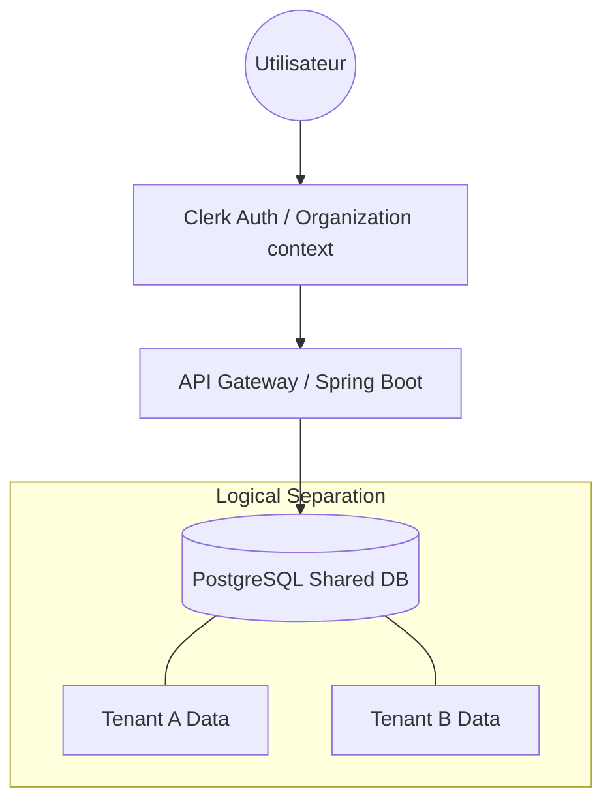
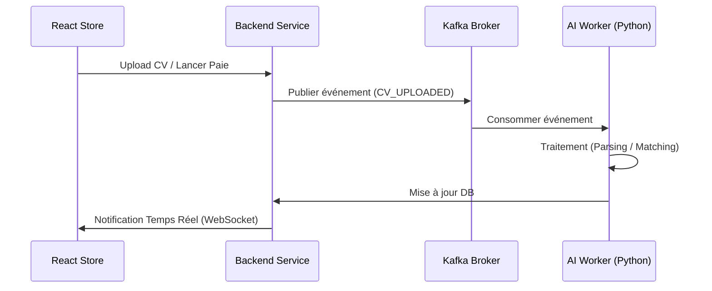

# WorkHub : Plateforme RH Intelligente Multi-Entreprises

[](https://spring.io/projects/spring-boot)
[](https://reactjs.org/)
[](https://www.postgresql.org/)
[](https://kafka.apache.org/)
[](https://clerk.com/)
[](https://tailwindcss.com/)

**WorkHub** est une solution SaaS (Software as a Service) de pointe conçue pour digitaliser l'intégralité du cycle de vie des Ressources Humaines. Destinée aux PME, elle propose une architecture **multi-tenant** isolant strictement les données de chaque entreprise tout en mutualisant l'infrastructure.

---

## 🚀 Vision du Projet
Le projet vise à transformer la gestion RH traditionnelle (Excel, papier) en un écosystème intelligent, automatisé et conforme à la législation marocaine.

### Points Forts :
- **Multi-Tenancy** : Isolation physique et logique des données par organisation.
- **Intelligence Artificielle** : Parsing de CV, scoring de matching candidat et prédiction de turnover.
- **Conformité Marocaine** : Calcul automatique de la paie incluant la CNSS, l'AMO et l'IR (Barème 2025/2026).
- **Temps Réel** : Système de notifications événementiel via Kafka.

---

## 🏗 Architecture Système

WorkHub repose sur une architecture moderne, orientée services et pilotée par les événements.

### 1. Modèle Multi-Tenant
La plateforme utilise une isolation **logique** au niveau de la base de données. Chaque requête est interceptée pour injecter le `tenant_id` (ID de l'organisation) via Clerk.



### 2. Flux Événementiel (Kafka)
Les processus lourds (Calculs de paie, IA) sont gérés de manière asynchrone pour garantir la réactivité de l'interface.



---

## 📁 Structure du Projet

L'organisation des fichiers suit les meilleures pratiques de séparation des préoccupations (SOC).

```text
workhub/
├── backend/                # Source du cœur métier (Spring Boot)
│   ├── src/main/java/com/workhub/
│   │   ├── config/         # Multi-tenancy, Security (Clerk), Kafka configs
│   │   ├── modules/        # Domain-Driven Design (Employee, Payroll, etc.)
│   │   │   ├── employee/   
│   │   │   ├── payroll/    # Logique spécifique Maroc (CNSS/AMO/IR)
│   │   │   └── leave/
│   │   └── WorkhubApplication.java
│   └── pom.xml
├── frontend/               # Interface Utilisateur (React 18)
│   ├── src/
│   │   ├── components/     # UI réutilisable (Tailwind)
│   │   ├── hooks/          # TanStack Query logic
│   │   ├── pages/          # Dashboard, Recruitment, Settings
│   │   └── services/       # Client API (Axios/Fetch)
│   └── tailwind.config.js
├── ai-service/             # Microservice Intelligence Artificielle (FastAPI)
│   ├── main.py             # Entry point
│   ├── models/             # BERT & Scikit-learn models
│   └── processors/         # CV Parsing & NLP logic
├── docker/                 # Configuration infrastructure
│   ├── kafka/              # Dockerfile & Config Kafka/Zookeeper
│   └── pg-init/            # Scripts d'initialisation DB
└── docker-compose.yml      # Orchestration globale
```

---

## 🛠 Stack Technique

### Backend (Cœur de métier)
- **Framework** : Spring Boot 3.x (Java 17)
- **Base de données** : PostgreSQL (Données structurées), Redis (Cache & Sessions)
- **Messaging** : Apache Kafka (Calculs asynchrones, notifications)
- **Stockage Objet** : MinIO (S3 compatible) pour les documents (CV, Bulletins)

### Frontend (User Experience)
- **Framework** : React 18
- **State Management** : TanStack Query
- **Design** : Tailwind CSS (UI Responsive & Moderne)

### Intelligence Artificielle (Microservices)
- **Framework** : Python FastAPI
- **NLP** : Hugging Face Transformers (BERT), Spacy
- **Machine Learning** : Scikit-learn (Random Forest pour le turnover)

### Sécurité & DevOps
- **Authentification** : Clerk (MFA, RBAC, Multi-org)
- **Conteneurisation** : Docker & Docker Compose
- **CI/CD** : GitHub Actions

---

## 📋 Modules Principaux

### 1. Gestion des Collaborateurs
- Dossiers numériques complets (Infos persos, contrats, documents).
- Archivage intelligent et historique des mouvements.
- Self-service employé (consultation profil, RIB).

### 2. Moteur de Paie Automatisé
- Génération mensuelle en un clic.
- Calcul précis : Salaire brut ➔ Net (Cotisations CNSS 4.48%, AMO 2.26%, IR progressif).
- Export de fichiers de virement bancaire et bulletins PDF.

### 3. Gestion des Congés & Absences
- Workflow d'approbation multiniveau.
- Calcul automatique des soldes (Convention 22 jours/an).
- Calendrier d'équipe partagé.

### 4. Recrutement IA (Smart Hiring)
- Publication d'offres multi-canaux.
- Analyse automatique des CV (NER) et scoring de pertinence.
- Suivi du pipeline de recrutement et planification d'entretiens.

### 5. Dashboard Analytics
- Indicateurs de performance (KPIs) en temps réel.
- Prédiction du turnover via Machine Learning.
- Analyse des gaps de compétences et recommandations de formation.

---

## ⚙️ Installation

### Prérequis
- Docker & Docker Compose
- Java 17+
- Node.js 18+

### Démarrage Rapide (Local)
1. **Cloner le repository** :
   ```bash
   git clone https://github.com/votre-compte/workhub.git
   cd workhub
   ```

2. **Lancer l'infrastructure (Docker)** :
   ```bash
   docker-compose up -d
   ```

3. **Backend** :
   ```bash
   cd backend
   ./mvnw spring-boot:run
   ```

4. **Frontend** :
   ```bash
   cd frontend
   npm install
   npm run dev
   ```

---

## 🗺 Roadmap du Projet

### Phase 1 : MVP (Mois 1-3)
- [ ] Socle Multi-tenant & Auth (Clerk).
- [ ] Module Employés & Congés.
- [ ] Paie v1 (Législation marocaine de base).
- [ ] Recrutement basique.

### Phase 2 : Intelligence & Optimisation (Mois 4-5)
- [ ] Microservice IA (CV Parsing & Matching).
- [ ] Dashboard Analytics avancé & Prédiction Turnover.
- [ ] Notifications temps réel (WebSockets).
- [ ] Export comptable avancé.

---

## ⚖️ Conformité Légale
Le système respecte scrupuleusement :
- **Code du travail marocain** : Congés, préavis, SMIG (3112 MAD).
- **Réglementation fiscale** : Barèmes IR progressifs 2025.
- **Protection des données** : Conformité RGPD et loi CNDP (Maroc).

---

## 📧 Contact & Support
**Auteur** : [Votre Nom / Équipe WorkHub]  
**Projet** : Projet de Fin d'Études (PFE)  
**Date de Soutenance** : 10 Avril 2026

---
*WorkHub - Simplifier les RH, Amplifier la Performance.*
